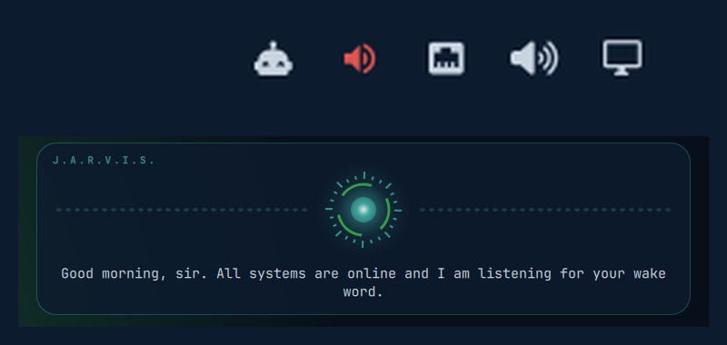

# Jarvis for Omarchy

A voice for whatever AI agent you're running in the terminal — with a way to shut it up.

- **Speaks** with free neural TTS: Edge TTS online, Piper offline, espeak-ng as a last resort.
- **Interrupts**: `jarvis hush` stops playback and drops the queue. Bound to a key, and to your
  dictation toggle so starting to talk silences it.
- **"Hey Jarvis"** wake word (openWakeWord, ~3% CPU): hush → chime → start dictation, hands-free.
- **Bar widget**: idle / speaking / listening / muted at a glance. Click to mute, right-click to
  hush, middle-click to toggle the wake word.
- **Pronunciation dictionary** so it says "plug-in", not "pluggin".
- **Agent-agnostic**: the core is a CLI (`jarvis say`, `jarvis hush`). Claude Code, Codex,
  Gemini CLI, or anything with hooks can drive it; dictation lands in whichever window is focused.



## Requirements

- Omarchy (Quickshell shell, Hyprland, PipeWire)
- `python3`, `jq`, `mpv` (or `ffplay` / `pw-play`)
- For the wake word: `pw-record` (PipeWire, already on Omarchy)
- For dictation via wake word: [Voxtype](https://github.com/peteonrails/voxtype) — `omarchy voxtype install`

## Install

```bash
omarchy plugin add https://github.com/jburchel/omarchy-jarvis --enable
~/.config/omarchy/plugins/io.github.jburchel.jarvis/bin/jarvis setup
ln -s ~/.config/omarchy/plugins/io.github.jburchel.jarvis/bin/jarvis ~/.local/bin/jarvis
```

`setup` creates a Python venv at `~/.local/share/jarvis/venv` with `edge-tts` and `piper-tts`,
downloads the `en_GB-alan-medium` Piper voice (~60 MB), writes `~/.config/jarvis/config.sh`,
and generates a chime. It does not touch any other config.

Then, optionally:

```bash
jarvis listen enable      # "Hey Jarvis" — installs a systemd --user service (jarvis-listen)
```

Add the widget to your bar if `--enable` didn't place it where you want:

```bash
omarchy bar move io.github.jburchel.jarvis --section right
```

### Keybindings (add to `~/.config/hypr/bindings.lua`)

```lua
o.bind("SUPER + SHIFT + J", "Jarvis hush", "jarvis hush")
-- Route your dictation key through Jarvis so it hushes first (Right Alt shown; use yours):
o.bind("code:108", "Toggle dictation", "jarvis dictate")
```

## Use

| | |
|---|---|
| `jarvis say "text"` | speak (queued) |
| `jarvis say --low "text"` | speak only if idle — for chatter like tool narration |
| `jarvis hush` | stop now, drop the queue |
| `jarvis mute` / `unmute` / `toggle-mute` | silence until told otherwise |
| `jarvis dictate` | hush, chime, run `JARVIS_DICTATE_CMD` (default `voxtype record toggle`) |
| `jarvis listen enable\|disable\|start\|stop\|status` | wake-word service |
| `jarvis pronounce plugin "plug-in"` | teach a pronunciation; no args lists them |
| `jarvis voice en-GB-ThomasNeural` | change the Edge voice (`jarvis voices` to list) |
| `jarvis piper-voice en_US-ryan-high` | download + set the offline voice |
| `jarvis test [edge\|piper\|espeak]` | hear a line |
| `jarvis status` / `jarvis log` | health / recent errors |

Settings live in `~/.config/jarvis/config.sh`; every key is documented with its default in
`bin/jarvis-env` (engine, voices, rate, wake-word threshold and action, how it addresses you,
visualizer colours, …).

State file: `$XDG_RUNTIME_DIR/jarvis-$UID/state` — `idle | speaking | listening | muted | off`.
The bar widget watches it; so can anything else.

## Hooking up an agent

Jarvis doesn't know which LLM you use. Your agent calls the CLI at the right moments:

- turn finished → `jarvis say "<short summary of the last message>"`
- needs approval / input → `jarvis say "Sir, I need your approval."`
- tool starting → `jarvis say --low "Editing config"`

**Claude Code:** a ready-made hooks plugin (Stop / Notification / PreToolUse / SessionStart,
with Haiku summaries of long replies) lives in the companion repo
[`jburchel/jarvis`](https://github.com/jburchel/jarvis).

**Codex CLI:** point `notify` in `~/.codex/config.toml` at a script that reads the JSON
payload and calls `jarvis say` on `agent-turn-complete`.

**Anything else:** if it has hooks, same pattern; if it doesn't,
`agent … | tee /dev/tty | tail -n 5 | jarvis say`.

## Remove

```bash
jarvis listen disable                 # stops + removes the systemd user service
omarchy plugin remove io.github.jburchel.jarvis
rm -f ~/.local/bin/jarvis
rm -rf ~/.local/share/jarvis          # venv, voices, chime  (optional)
rm -rf ~/.config/jarvis               # config, pronunciations, mute flag  (optional)
```

Remove the two `o.bind` lines from `bindings.lua` if you added them. Nothing else is written
outside those paths and `$XDG_RUNTIME_DIR/jarvis-$UID/` (cleared on reboot).

## Privacy

- Edge TTS sends the *text to be spoken* to Microsoft's servers. Set `JARVIS_ENGINE="piper"`
  for fully offline speech.
- The wake-word daemon processes microphone audio **locally only** (openWakeWord, ONNX on CPU).
  Nothing is recorded or sent anywhere. While Voxtype is recording, the daemon ignores input.
- Dictation itself is Voxtype's — whisper.cpp, local.

## License

MIT — see [LICENSE](LICENSE), which also lists the third-party components this plugin
installs or depends on.
